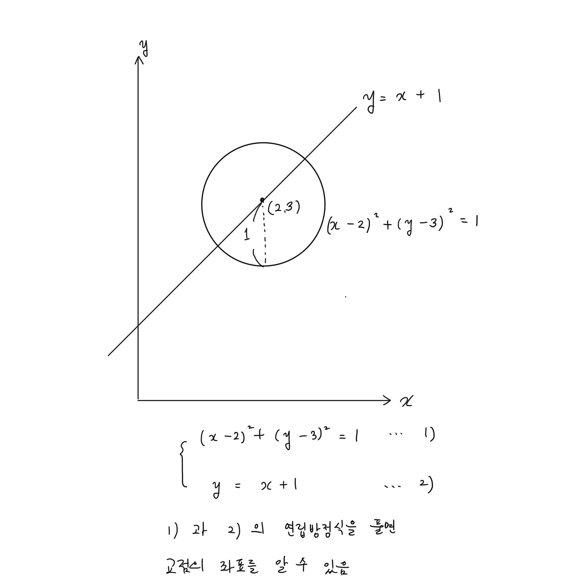
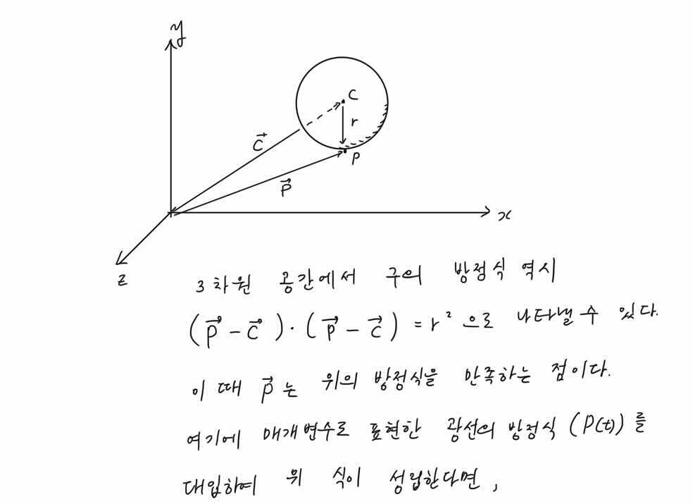
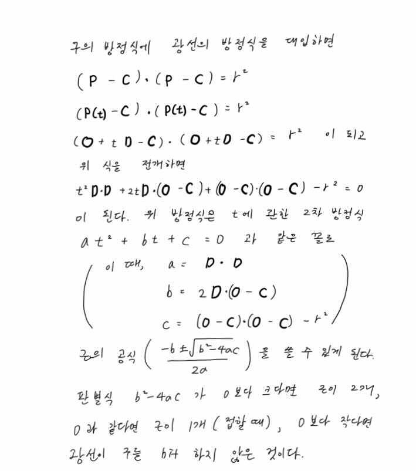

# 4. 구
우리는 3차원 공간에서 여러가지 object를 구현하는 것을 목적으로 한다. 여러가지 object 중 가장 구현하기 쉬운 구부터 구현하여 레이 트레이싱의 원리에 대해 조금 더 쉽게 접근 할 수 있도록 교재를 만들어 보았다.

---
## 4.1. 실습목표
> 1. 구의 구조체 만들기.
>
> 2. 구의 생성자 만들기.
>
> 3. hit_sphere함수 만들기
>
> 4. ray_color 수정.
>

---
## 4.2. 구의 구조체 만들기.

구에 대한 데이터를 저장할 구조체를 만들어준다. 구를 만들 때 필요한 것은 무엇일까?
아주 간단하다. 중심의 위치와 반지름의 길이만 알면 된다. 반지름의 제곱 값도 자주 쓰이니 반지름의 제곱도 구조체의 멤버로 추가해주자.

``` c

    ...

    typedef struct s_camera	t_camera;
    typedef struct s_canvas	t_canvas;

    // 추가
    // 3. 오브젝트 구조체
    typedef struct s_sphere	t_sphere;


    // 4. 식별자 매크로
    typedef int				t_bool;
    # define FALSE 0
    # define TRUE 1
    // 추가 끝

    ...

    // 추가
    // 오브젝트 구조체
    struct	s_sphere
    {
    	t_point3	center;
    	double		radius;
    	double		radius2;
    };
    // 추가 끝
    #endif

```

***Code1 : [miniRT/include/structures.h]***

구의 구조체를 추가하고 후에 필요할 식별자 매크로를 추가해주었다.
다음은 구에 관한 정보들을 가지고 구를 만들 생성자 함수를 작성해보자.

---

## 4.3. 구의 생성자 만들기.

다음은 구의 정보들을 가지고 3차원 공간에 구를 만들어줄 생성자 함수를 만들어보자.

``` c
    #include "structures.h"

    t_sphere	sphere(t_point3 center, double radius)
    {
    	t_sphere sp;

    	sp.center = center;
    	sp.radius = radius;
    	sp.radius2 = radius * radius;
    	return (sp);
    }
```

***Code2 : [miniRT/src/scene/object_create.c]***

오브젝트를 만드는 함수는 장면을 구성할 함수이므로 scene.h에 생성자의 프로토타입을 추가해주자.

``` c
    t_canvas	canvas(int	width, int height);
    t_camera	camera(t_canvas *canvas, t_point3 origin);
    // 추가
    t_sphere	sphere(t_point3 center, double radius);
    // 추가 끝
```

***Code3 : [miniRT/include/scene.h]***

구의 구조체와 구의 생성자를 추가했으니, 메인문을 수정해보자.

``` c
    t_canvas	canv;
	t_camera	cam;
	t_ray		ray;
    // 추가
	t_sphere	sp;
    // 추가 끝
	//Scene setting;
	canv = canvas(400, 300);
	cam = camera(&canv, point3(0, 0, 0));
    // 추가
	sp = sphere(point3(0, 0, -5), 2);
    // 추가 끝
	// 랜더링
	// P3 는 색상값이 아스키코드라는 뜻, 그리고 다음 줄은 캔버스의 가로, 세로 픽셀 수, 마지막은 사용할 색상값
	printf("P3\n%d %d\n255\n", canv.width, canv.height);

    ...

        //ray from camera origin to pixel
		ray = ray_primary(&cam, u, v);
        // 제거
		pixel_color = ray_color(&ray);
        // 제거 끝
        // 추가
		pixel_color = ray_color(&ray, &sp);
        // 추가 끝
		write_color(pixel_color);
	    ++i;
	}
```

***Code4 : [miniRT/src/main.c]***

---

## 4.4. hit_sphere함수 만들기

이제 Primary ray가 구에 닿았는지(hit 했는지)를 판단해야 한다. 광선이 뷰포트를 지나 구를 hit 했다면, 해당 픽셀을 구의 색깔로 칠해줘야 한다.

어떻게 광선이 구를 hit 했는지 판단할 수 있을까??
직선의 방정식과 원의 방정식을 떠올려보자(**이미지1**).


***이미지1: 2차원 평면에서의 원과 직선의 방정식***

하지만 우리는 직선의 방정식 대신 (매개변수로 표현한)광선의 벡터 방정식을 알고 있다. 구의 방정식을 벡터로 표현한 후 두 방정식을 연립하여 풀면 광선의 원점으로부터 교점 사이의 거리 t를 구할 수 있을 것이다. 구의 방정식을 어떻게 벡터로 표현할 수 있을까? 먼저 2차원 평면에서 생각해보자(**이미지2**).


***이미지2: 벡터로 나타낸 원의 방정식***

벡터로 나타낸 구의 방정식도 같고(**이미지3**), 구와 광선의 방정식을 연립하여 계산해보자(**이미지4**)



***이미지3: 벡터로 나타낸 구의 방정식***



***이미지4: 구와 광선의 방정식을 연립해보자***

위 식을 코드로 작성해보자.

``` c
    #include "structures.h"
    #include "utils.h"

    t_bool		hit_sphere(t_sphere *sp, t_ray *ray)
    {
    	t_vec3	oc; //방향벡터로 나타낸 구의 중심.
        //a, b, c는 각각 t에 관한 2차 방정식의 계수
    	double	a; 
    	double	b;
    	double	c;
    	double	discriminant; //판별식

    	oc = vminus(ray->orig, sp->center);
    	a = vdot(ray->dir, ray->dir);
    	b = 2.0 * vdot(oc, ray->dir);
    	c = vdot(oc, oc) - sp->radius2;
        // discriminant 는 판별식
    	discriminant = b * b - 4 * a * c;

        // 판별식이 0보다 크다면 광선이 구를 hit한 것!
    	return (discriminant > 0);
    }
```

***Code5 : [miniRT/src/trace/hit/hit_sphere.c]***

---

## 4.5. ray_color 수정.

이제 hit_sphere 함수를 ray_color에 반영해주자.

``` c
...

    //광선이 최종적으로 얻게된 픽셀의 색상 값을 리턴.
    // 제거
    t_color3	ray_color(t_ray *ray)
    // 제거 끝
    // 추가
    t_color3	ray_color(t_ray *ray, t_sphere *sphere)
    // 추가 끝
    {
    	double	t;
    // 제거
    	//ray의 방향벡터의 y 값을 기준으로 그라데이션을 주기 위한 계수.
    	t = 0.5 * (ray->dir.y + 1.0);
    	// (1-t) * 흰색 + t * 하늘색
    	return (vplus(vmult(color3(1, 1, 1), 1.0 - t), vmult(color3(0.5, 0.7, 1.0), t)));
    // 제거 끝
    // 추가

    	if (hit_sphere(sphere, ray))
    		return (color3(1, 0, 0));
    	else
    	{
    		//ray의 방향벡터의 y 값을 기준으로 그라데이션을 주기 위한 계수.
    		t = 0.5 * (ray->dir.y + 1.0);
    		// (1-t) * 흰색 + t * 하늘색
    		return (vplus(vmult(color3(1, 1, 1), 1.0 - t), vmult(color3(0.5, 0.7, 1.0),     t)));
    	}
    // 추가 끝
    }
```

***Code6 : [miniRT/src/trace/ray.c → miniRT/src/trace/ray/ray.c]***

구를 hit한 경우에는 빨간색을(albedo; 1, 0, 0), hit하지 못한 경우에는 배경인 하늘색을 표현하도록 수정했다.

hit_sphere 역시 tracing과 관련된 함수이므로 trace.h에 함수의 선언부를 추가해주자.

``` c
    # include "structures.h"
    # include "utils.h"
    // 추가
    // trace/ray/
    // 추가 끝
    t_ray		ray(t_point3 orig, t_vec3 dir);
    t_ray		ray_primary(t_camera *cam, double u, double v);
    t_point3	ray_at(t_ray *ray, double t);
    // 제거
    t_color3	ray_color(t_ray *r);
    // 제거 끝
    // 추가
    t_color3	ray_color(t_ray *ray, t_sphere *sphere);

    // trace/hit/
    t_bool		hit_sphere(t_sphere *sp, t_ray *ray);
    // 추가 끝
    #endif

```

***Code7 : [miniRT/include/trace.h]***

결과물은 다음과 같다(**이미지5**).


***이미지5***