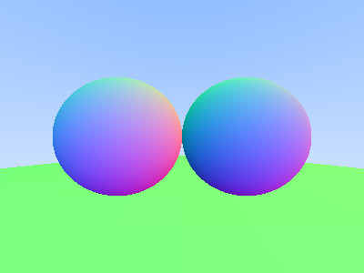

# 7. 오브젝트

이번 장에서는 여러가지 오브젝트(도형)들을 하나의 오브젝트로 다루기 위해 object라는 리스트를 만드려고 한다.

## 7.1. 실습목표

>1. object 리스트에 대해 알아보고 리스트를 만든다. 이 전에 만든 함수들을 object 리스트에 맞게 수정한다.

## 7.2. object

6단원까지는 sphere 하나의 object를 구현하고 저장하였지만 앞으로 여러가지의 object를 추가할 수 있게 하기 위해서 코드의 수정이 필요하다. 우선 여러가지의 object를 저장할 수 있어야하고 그 object들을 한번에 가지고 다닐 수 있어야한다. ray는 여러개의 object 중 가장 가까이에 있는 object에 히트를 해야한다.

우리는 object라는 리스트를 만들어 각 도형의 정보를 저장할 것이다. 그리고 기존에 sphere에만 적용 가능했던 함수들을 조금씩 손봐줄 예정이다.

먼저 다음과 같은 구조체를 만들어서 structures.h에 추가해주자.

```c
...
  
// 3. 오브젝트 구조체
// 추가
typedef struct s_object t_object;
// 추가 끝
typedef struct s_sphere	t_sphere;

...
  
# define FALSE 0
# define TRUE 1
// 추가
typedef int				t_object_type;
# define SP 0
// 추가 끝

...
  
// 오브젝트 구조체
// 추가
struct						s_object
{
	t_object_type	type;
	void			*element;
	void			*next;
};
// 추가 끝

#endif
```

***Code1 : [miniRT/include/structures.h]***

Object  리스트 안에 type은 object 리스트를 봤을 때 현재 리스트가 가리키는 도형이 무엇인지 바로 알 수 있기 위해 추가하였다. 그리고 우리는 sphere라는 도형은 매크로 SP로 type을 지정했다. 리스트의 element에 각 도형의 데이터를 저장할 것이다.

## 7.3. object 적용

object 리스트를 구현했으니 hit함수를 추가하여 object를 받을 수 있게 하자. 그리고 ray_color도 t_sphere에만 한정되지 않는 함수로 바꾸어 주자.

```c
t_point3	ray_at(t_ray *ray, double t);
// 추가
t_color3	ray_color(t_ray *ray, t_object *world); // 수정.

// trace/hit/
t_bool		hit(t_object *obj, t_ray *ray, t_hit_record *rec);
t_bool		hit_obj(t_object *obj, t_ray *ray, t_hit_record *rec);
// 추가 끝
double		hit_sphere(t_sphere *sp, t_ray *ray, t_hit_record *rec);
```

***Code2 : [miniRT/include/trace.h]***

``` c
// 추가
#include "trace.h"

t_bool		hit(t_object *world, t_ray *ray, t_hit_record *rec)
{
	t_bool			hit_anything;
	t_hit_record	temp_rec;

	temp_rec = *rec; // temp_rec의 tmin, tmax 값 초기화를 위해.
	hit_anything = FALSE;
	while(world)
	{
		if (hit_obj(world, ray, &temp_rec))
		{
			hit_anything = TRUE;
			temp_rec.tmax = temp_rec.t;
			*rec = temp_rec;
		}
		world = world->next;
	}
	return (hit_anything);
}

// hit_obj는 오브젝트 타입에 맞는 hit함수로 연결해주는 관문
t_bool		hit_obj(t_object *world, t_ray *ray, t_hit_record *rec)
{
	t_bool	hit_result;

	hit_result = FALSE;
	if (world->type == SP)
		hit_result = hit_sphere(world->element, ray, rec);
	return (hit_result);
}
// 추가 끝
```

***Code3 : [miniRT/src/trace/hit/hit.c]***

각 object를 순회하며 ray를 맞았는지 확인하기 위하여 hit라는 함수를 만들어 준다. 우리는 여러가지 오브젝트가 존재할 때에 더 가까이 있는 오브젝트를 히트해야한다. 그러므로 어떠한 오브젝트에 히트하면 tmax를 히트한 t로 바꾸어 그 다음 오브젝트를 검사할 때에 더 멀리 있는 오브젝트일 경우 히트가 안되게 했다.

hit_obj에서는 리스트에 어떤 object가 저장되어 있는지 확인한 후 각각의 object에 맞는 함수를 실행할 수 있게 분기해주었다.

각 sphere와 object를 초기화 할 수 있는 함수를 만들어 보자.

```c
// 제거
#include "structures.h"

t_sphere	sphere(t_point3 center, double radius)
{
	t_sphere sp;

	sp.center = center;
	sp.radius = radius;
	sp.radius2 = radius * radius;
  return (sp);
}
// 제거 끝
// 추가 
#include "scene.h"

t_object	*object(t_object_type type, void *element)
{
	t_object	*new;

	if (!(new = (t_object *)malloc(sizeof(t_object))))
		return (NULL);
	new->type = type;
	new->element = element;
	new->next = NULL;
	return (new);
}

t_sphere	*sphere(t_point3 center, double radius)
{
	t_sphere *sp;

	if(!(sp = (t_sphere *)malloc(sizeof(t_sphere))))
		return (NULL);
	sp->center = center;
	sp->radius = radius;
	sp->radius2 = radius * radius;
	return (sp);
}
// 추가 끝
```

***Code4: [miniRT/src/scene/object_create.c]***

`object`함수는 리스트에 추가할 object를 만드는 생성자이다. 그리고 sphere는 sphere의 데이터를 저장하는 함수이다.
`sphere`함수로 만든 구조체가 object의 element에 들어가는 것이다.
`object`함수와 `sphere`함수 모두 장면을 구성하는 함수이므로 scene.h 파일에 추가해주자.

```c
...
// 추가
t_object	*object(t_object_type type, void *element);
// 추가 끝
t_sphere	*sphere(t_point3 center, double radius);
```

***Code5: [miniRT/include/scene.h]***

이제 `object`함수로 만든 오브젝트들을 오브젝트 리스트에 추가할 함수들을 만들어주자.

```c
#include "utils.h"

void		oadd(t_object **list, t_object *new)
{
	t_object	*cur;

	if (*list == NULL)
	{
		*list = new;
		return ;
	}
	cur = *list;
	while (cur->next)
		cur = cur->next;
	cur->next = new;
}

t_object	*olast(t_object *list)
{
	if (list == NULL)
		return (NULL);
	while (list->next)
		list = list->next;
	return (list);
}
```

***Code6: [miniRT/src/utils/object_utils.c]***

각각 리스트 추가, 리스트의 마지막으로 이동하는 함수들이다. 위 함수들을 `utils.h`에 추가해주자.

``` c
...

// 추가
// 오브젝트 유틸리티
void		oadd(t_object **list, t_object *new);
t_object	*olast(t_object *list);
// 추가 끝

#endif
```

***Code7: [miniRT/include/utils.h]***

t_sphere를 바로 사용하던 ray_color를 수정해주자.

``` c
//광선이 최종적으로 얻게된 픽셀의 색상 값을 리턴.
// 수정
t_color3	ray_color(t_ray *ray, t_object *world)
// 수정 끝
{
	double			t;
	t_vec3			n;
  
  ...

	rec.tmin = 0;
	rec.tmax = INFINITY;
	//광선이 구에 적중하면(광선과 구가 교점이 있고, 교점이 카메라 앞쪽이라면!)
  // 수정
	if (hit(world, ray, &rec))
  // 수정 끝
		return (vmult(vplus(rec.normal, color3(1, 1, 1)), 0.5));
    
```

***Code8: [miniRT/src/trace/ray/ray.c]***

sphere구조체를 받던 함수를 object를 받게 바꾸었다.

바뀐 구조를 적용하여 main을 수정해보자.

``` c
	t_canvas	canv;
	t_camera	cam;
	t_ray		ray;
	// 제거
	t_sphere sp;
	// 제거 끝
	// 추가
	t_object	*world;
	// 추가 끝

	//Scene setting;
	canv = canvas(400, 300);
	cam = camera(&canv, point3(0, 0, 0));
	// 제거
	sp = sphere(point3(0, 0, -5), 2);
	// 제거 끝
	// 추가
	world = object(SP, sphere(point3(-2, 0, -5), 2)); // world 에 구1 추가
	oadd(&world, object(SP, sphere(point3(2, 0, -5), 2))); // world 에 구2 추가
	oadd(&world, object(SP, sphere(point3(0, -1000, 0), 990))); // world 에 구3 추가
	// 추가 끝
	// 랜더링

...

	//ray from camera origin to pixel
	ray = ray_primary(&cam, u, v);
	// 제거
	pixel_color = ray_color(&ray, &sp);
	// 제거 끝
	// 추가
	pixel_color = ray_color(&ray, world);
	// 추가 끝
	write_color(pixel_color);
```

***Code9: [miniRT/src/main.c]***

기존 sphere를 추가하는 부분에서 object를 추가하고 그 곳에 sphere를 추가하는 코드로 변경했다.

지금까지 코드를 수정한 결과는 다음과 같다(**이미지1**).



**이미지1**
