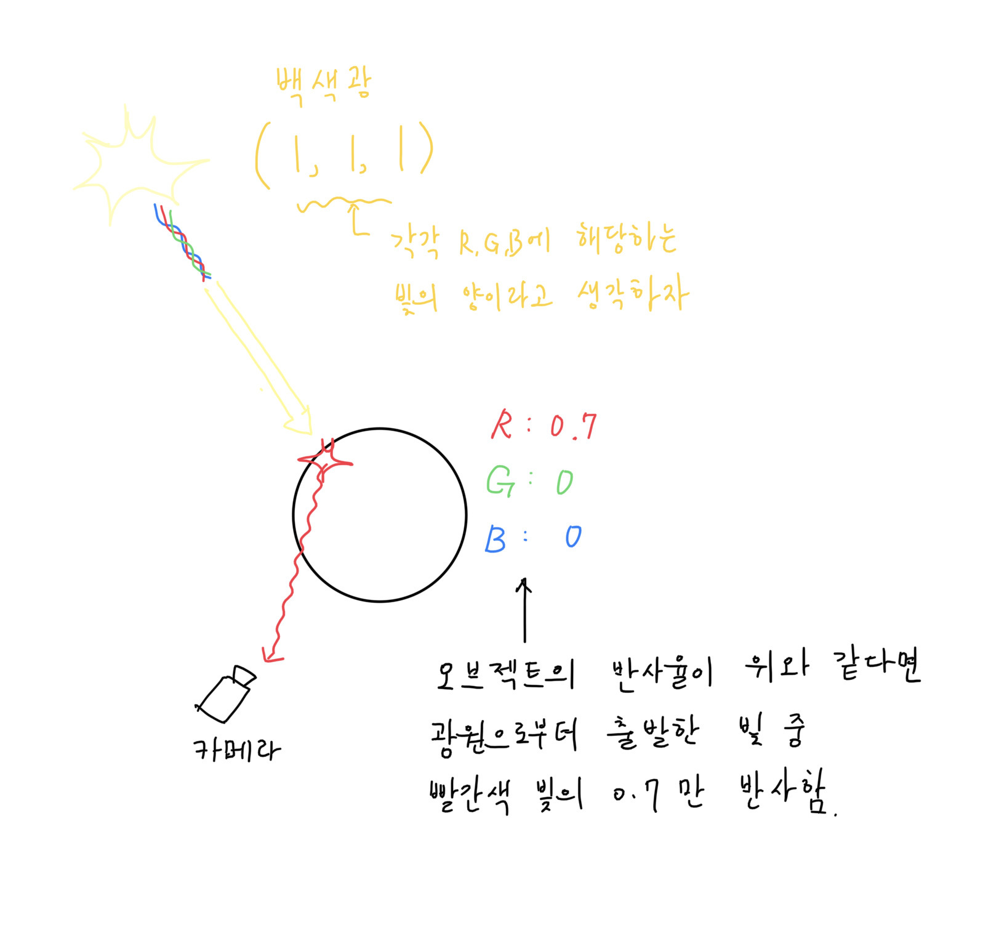
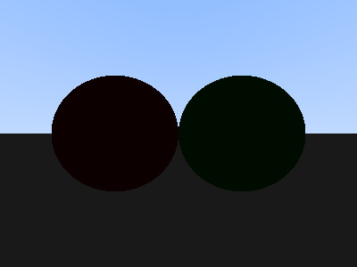
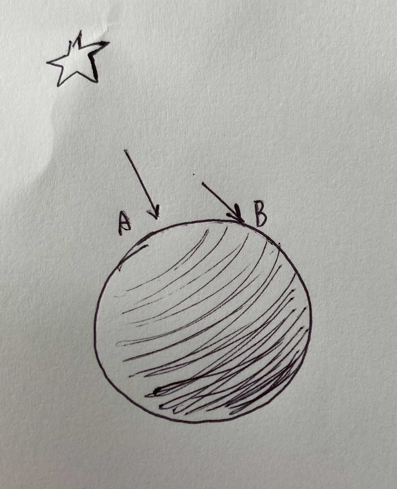
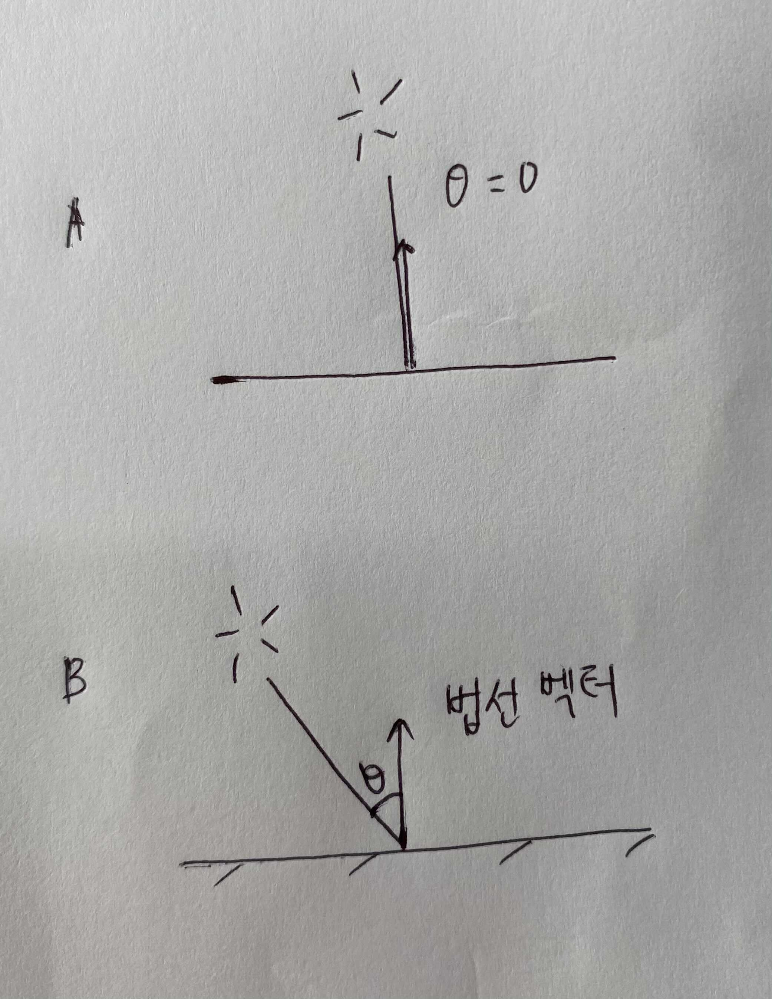

# 8. Phong lighting

드디어 오브젝트에 색을 입히고, 빛을 고려해주는 단계에 들어섰다...

## 8.1. 실습목표
>1. light 구조체/ light 생성자 만들기
>2. light를 관리할 오브젝트 리스트 만들기
>3. phong_lighting에 대한 학습 및 적용
>4. scene 구조체 정의

## 8.1.1. ray tracing?

이번 장에서 우리는 **빛**을 고려할 것이다. 3차원 공간에 **광원**을 놓고, 광원으로부터 나온 빛이 **오브젝트에 미치는 영향**을 계산할 것이다.

광원 하나에서 백색광이 나온다고 생각해보자. 백색광을 [1, 0]으로 매핑된 RGB로 표현한다면 (1, 1, 1)이 될 것이다. 광원으로부터 출발한 백색광이 반사율(=albedo) (0.7, 0, 0)인 구에 반사되어 우리 눈에 들어온다면, (1, 1, 1) 중 G와 B에 해당하는 1은 구에 흡수될 것이고 R에 해당하는 1 중 70퍼센트만 반사되어 우리 눈에 들어올 것이다(**이미지1**).


***이미지1: 빛이 물체에 반사되어 눈에 들어오는 과정***

백색광(1, 1, 1)이 하나 더 있다면, 교점에 들어오는 광량은 (2, 2, 2)이 될 것이고 오브젝트는 (1.4, 0, 0)를 반사할 것이다(RGB값을 [0, 1]로 매핑했으므로 1을 초과하는 값은 1이 되겠지만 말이다). 반대로 공간 안에 광원이 하나도 없다면 오브젝트는 반사할 빛이 없으므로 검은색일 것이다(밤에 불꺼진 방에서 아무것도 보이지 않듯이).

광원의 개수 말고도 오브젝트가 어떻게 보일지 영향을 미치는 요소가 더 있다. 실제 상황을 생각해보자. 먼저 광원과 오브젝트 사이의 거리가 영향을 미칠 것이다. 물체의 표면이 어떤 재질인지, 정반사를 하는지, 난반사를 하는지도 영향을 미칠 것이다. 또한 다른 물체에 반사되어 들어온 빛, 대기 중의 입자에 의해 산란되어 들어온 빛, 투명한 물체에 의해 굴절되어 들어온 빛 등 다양한 요소들이 있다. 이렇게 우리의 눈(또는 카메라)에 들어온 모든 빛을 고려하는 렌더링 기법이 ray tracing이다.

실제 상황처럼 모든 상호작용을 고려하면 렌더링된 이미지는 점점 더 정확해진다. 이렇게 모든 요소를 고려하기 위해서는 빛의 물리학을 점점 더 자세하게 알아야 한다(실제로 렌더링은 물리학의 원리에 따라 발전하고 있고, 에너지 보존 법칙과 같은 물리 법칙들이 반영되어 있다). 하지만 이 교재는 렌더링을 처음 접하는 사람들을 위해 만들어졌다. 그러므로 우리는 레이트레이싱이 아닌 **퐁 조명 모델**을 사용한다.

## 8.1.1. Phong lighting?

퐁 조명 모델은 보다 간단한 물리 법칙에 기반한다. 퐁 조명 모델도 광선을 추적한다. 하지만 딱 한 단계, 광원에서 빛이 나와서 물체에 반사되어 눈에 들어오는 단계만 수학적으로 계산한다. 퐁 조명 모델에 사용되는 중요한 물리학적 기법은 퐁 반사 모델이다. 퐁 반사 모델은 광원에서 나온 빛이 물체에 반사되어 나올 때, 그 조도가 어느 정도가 되는지를 구하는 데에 활용되는 모델이다. 

퐁 반사 모델은 조도를 구할 때 세 가지 요소를 고려한다. ambient lighting, diffuse lighting, specular lighting. 세 가지 조명은 다음과 같다.
> ambient lighting(주변 조명) : 밝은 낮 어두운 그늘에 들어가도 물체가 보이는 것처럼, 공기 중에 산란되어 존재하는 빛으로 인해 물체가 밝아지는 것을 묘사함(**이미지2**의 첫 번째 그림).
> diffuse lighting(확산 조명) : 난반사의 역할. 광선이 물체에 비스듬하게 들어올 수록 단위 면적 당 들어오는 광선의 수가 적다는 논리로, **이미지2**의 두 번째 그림과 같은 결과를 출력함
> specular lighting(반사광) : 정반사의 역할로 거울처럼 매끈한 면에서 일어나는 빛 반사를 담당하는 요소로 **이미지**의 세 번째 그림과 같은 결과를 출력함.
>
>위 세 가지 요소를 모두 결합하면 가장 오른쪽에 있는 결과가 나온다.


***이미지2: [출처](https://learnopengl.com/Lighting/Basic-Lighting)***

각각의 요소를 계산하는 방법과 코드는 이번 장의 3번째 섹션([8.4. phong lighting](#8.4.-phong-lighting-model))을 참고하자.

## 8.2. albedo추가 /light 구조체/ light 생성자/ light 리스트

### 8.2.1 광원
광원에는 기본적으로 [**평행광원**(Direct lighting ex) 태양) **점광원**(Point light) **집중광원**(Spot light)이 있는데](https://heinleinsgame.tistory.com/19) 이번 장에서는  **점광원**만을 다룬다.
먼저 광원의 원점, 광원의 색, 밝기 정보를 담을 t_light 구조체를 정의해주고, 점광원(light_point)의 오브젝트 타입 식별자 메크로를 정의해준다.

```h
typedef struct s_object t_object;
typedef struct s_sphere	t_sphere;
// 추가
typedef struct s_light	t_light;
// 추가 끝

...

typedef int				t_object_type;
# define SP 0
// 추가
# define LIGHT_POINT 1
// 추가 끝

...

struct	s_sphere
{
	t_point3	center;
	double		radius;
	double		radius2;
};

// 추가
struct						s_light
{
	t_point3		origin;
	t_color3		light_color;
	double			bright_ratio;
};
// 추가 끝
```
***Code1 : [miniRT/include/structures.h]***

light 구조체 생성자도 만들어 주자

```c
...

t_sphere	*sphere(t_point3 center, double radius)
{
	t_sphere *sp;
	if(!(sp = (t_sphere *)malloc(sizeof(t_sphere))))
		return (NULL);
	sp->center = center;
	sp->radius = radius;
	sp->radius2 = radius * radius;
	return (sp);
}

// 추가
t_light		*light_point(t_point3 light_origin, t_color3 light_color, double bright_ratio)
{
	t_light	*light;

	if(!(light = (t_light *)malloc(sizeof(t_light))))
		return (NULL);
	light->origin = light_origin;
	light->light_color = light_color;
	light->bright_ratio = bright_ratio;
	return (light);
};
// 추가 끝
```
***Code2 : [miniRT/src/scene/object_create.c]*** 

### 8.2.2. 반사율

광원과 오브젝트의 상호작용을 통해 픽셀의 색상을 얻어오기 위해 `t_object` 구조체와 `t_hit_record` 구조체에 반사율(albedo) 멤버를 추가해 줍니다. 

```c
...

struct s_hit_record
{
	t_point3	p;
	t_vec3		normal;
	t_bool		front_face;
	double		tmin;
	double		tmax;
	double		t;
	t_bool		front_face;
	// 추가
	t_color3	albedo;
	// 추가 끝
};

...

struct						s_object
{
	t_object_type	type;
	void			*element;
	void			*next;
	// 추가
	t_color3		albedo;
	// 추가 끝
};
```
***Code3 : [miniRT/include/structures.h]*** 

오브젝트 생성자의 반사율(albedo) 인자를 추가해준다.

```c
#include "scene.h"
// 수정
t_object	*object(t_object_type type, void *element, t_color3 albedo)
// 수정 끝
{
	t_object	*new;

	if (!(new = (t_object *)malloc(sizeof(t_object))))
		return (NULL);
	new->type = type;
	new->element = element;
	new->next = NULL;
	// 추가
	new->albedo = albedo;
	// 추가 끝
	return (new);
}
```
***Code4 : [miniRT/src/scene/object_create.c]*** 

헤더 파일도 수정해준다.
```c

...
// 수정
t_object	*object(t_object_type type, void *element, t_color3 albedo);
//수정 끝
```
***Code5 : [miniRT/include/scene.h]*** 

`hit_sphere()` 함수도 record에 albedo를 기록할 수 있도록 수정해준다.

```c
// 수정
double		hit_sphere(t_object *sp_obj, t_ray *ray, t_hit_record *rec)
// 수정 끝
{
	// 추가
	t_sphere	*sp;
	// 추가 끝
	t_vec3		oc;
	double		a;
	double		half_b;
	double		c;
	double		discriminant; //판별식
	double		sqrtd;
	double		root;

	// 추가
	sp = sp_obj->element;
	// 추가 끝

	...

	// 추가
	rec->albedo = sp_obj->albedo;
	// 추가 끝
	return (TRUE);
}

```
***Code6 : [miniRT/src/trace/hit/hit_sphere.c]*** 

## 8.3. 장면 설정

지금 까지는 장면에 존재하는 오브젝트의 리스트는 `t_object *world`변수 뿐이였지만 여러 광원을 다루기 위해 별도의 오브젝트 리스트 `t_object *lights`가 하나 더 필요해졌다. 기존 함수에 인자로 추가해 줄 수도 있겠지만,

 이 쯤 에서 함수들의 인자가 더 늘어나는 것을 막기 위해, 장면의 데이터(카메라, 캔버스, 물체 리스트, 광원 리스트 ...)를 통합하여 관리할 수 있는 scene 구조체를 만들고 기존 코드를 한번 정리하고 가보자

```c
...

struct	s_canvas
{
	int		width; //canvas width
	int		height; //canvas height;
	double	aspect_ratio; //종횡비
};

// 추가
struct	s_scene
{
	t_canvas		canvas;
	t_camera		camera;
	t_object		*world;
	t_object		*light;
	t_ray			ray;
	t_hit_record	rec;
};
// 추가 끝
```
***Code7 : [miniRT/include/structures.h]***

`t_scene *scene` 변수의 데이터를 설정해주는 `scene_init()`함수를 정의하고, main 함수의 코드를 수정해보자.

```c
#include "print.h"
#include "trace.h"

// 추가
t_scene	*scene_init(void)
{
	t_scene		*scene;
	t_object	*world;
	t_object	*lights;

	// malloc 할당 실패 시, 실습에서는 return NULL로 해두었지만, 적절한 에러 처리가 필요하다.
	if(!(scene = (t_scene *)malloc(sizeof(t_scene))))
		return (NULL);
	scene->canvas = canvas(400, 300);
	scene->camera = camera(&scene->canvas, point3(0, 0, 0));
	world = object(SP, sphere(point3(-2, 0, -5), 2), color3(0.5, 0, 0)); // world 에 구1 추가
	oadd(&world, object(SP, sphere(point3(2, 0, -5), 2), color3(0, 0.5, 0))); // world 에 구2 추가
	oadd(&world, object(SP, sphere(point3(0, -1000, 0), 1000), color3(1, 1, 1))); // world 에 구3 추가
	scene->world = world;
	lights = object(LIGHT_POINT, light_point(point3(0, 5, 0), color3(1, 1, 1), 0.5), color3(0, 0, 0)); // 더미 albedo
	scene->light = lights;
	return (scene);
}
// 추가 끝

int		main(void)
{
	int			i;
	int			j;
	double		u;
	double		v;
	t_color3	pixel_color;
	// 수정
	t_scene		*scene;
	
	scene = scene_init();
	// 랜더링
	// P3 는 색상값이 아스키코드라는 뜻, 그리고 다음 줄은 캔버스의 가로, 세로 픽셀 수, 마지막은 사용할 색상값
	// 수정
	printf("P3\n%d %d\n255\n", scene->canvas.width, scene->canvas.height);
	j = scene->canvas.height - 1;
	while (j >= 0)
	{
		i = 0;
		while (i < scene->canvas.width)
		{
			u = (double)i / (scene->canvas.width - 1);
			v = (double)j / (scene->canvas.height - 1);
			//ray from camera origin to pixel
			scene->ray = ray_primary(&scene->camera, u, v);
			pixel_color = ray_color(scene); 
			// ray_color함수의 인자도 ray, world를 모두 담고 있는 scene으로 바꿨다.
	// 수정 끝
			write_color(pixel_color);
			++i;
		}
		--j;
	}
	return (0);
}
```
***Code8 : [miniRT/src/main.c]***

ray_color 함수의 인자를 ray와 world를 모두 담고 있는 scene으로 바꿨다. ray_color 함수 내부도 수정해주자.

### 8.3.1 ray_color 업데이트

`ray_color()` 함수의 인자를 `t_scene` 포인터로 변경해 주고, `t_hit_record` 변수를 초기화 해주는 함수를 `record_init()`함수를 추가한다. `record_init()` 함수에서 tmin 값을 초기화 해줄 때 0 이 아닌 **EPSILON(0.000001)** 으로 해주는데, 이는 double 데이터 타입이 근사값이기 때문이다. hit 함수에서 t의 값이 0에 가까운 값이 나올 때, tmin이 0 이면 비교 시 hit 상황이 아닐 때도 hit로 판단하는 오차를 만들어낼 수 있기 때문에 tmin 값을 EPSILON으로 설정하여 이러한 상황을 예방해줄 수 있다.

```c

...

// 추가
t_hit_record record_init(void)
{
	t_hit_record	record;

	record.tmin = EPSILON;
	record.tmax = INFINITY;
	return (record);
}
// 추가 끝

t_color3	ray_color(t_scene *scene)
{
	double			t;
	t_vec3			n;
	// 수정
	//광선이 구에 적중하면(광선과 구가 교점이 있고, 교점이 카메라 앞쪽이라면!)
	if (hit(scene->world, &scene->ray, &scene->rec))
		return (phong_lighting(scene)); //이제 법선 벡터를 매핑해서 얻은 색이 아닌, 앞으로 작성할 phong_lighting 함수의 결과값을 반환한다!
	else
	{
		//ray의 방향벡터의 y 값을 기준으로 그라데이션을 주기 위한 계수.
		t = 0.5 * (ray->dir.y + 1.0);
		t = 0.5 * (scene->ray.dir.y + 1.0);
		// (1-t) * 흰색 + t * 하늘색
		return (vplus(vmult(color3(1, 1, 1), 1.0 - t), vmult(color3(0.5, 0.7, 1.0), t)));
	}
}
```
***Code9: [miniRT/src/trace/ray/ray.c]***

`ray_color` 함수의 인자가 변경되었으니 `trace.h` 파일도 수정해주자.
```c
...
//t_color3	ray_color(t_ray *ray, t_object *world); 아래와 같이 수정.
t_color3	ray_color(t_scene *scene);
...
```
***Code10: [miniRT/include/trace.h]***

---
## 8.4. Phong lighting model

드디어 퐁 조명 모델을 적용할 차례다. 이번 챕터를 이해하고 코드로 작성하면, 오브젝트에 빛을 입힐 수 있게 된다!

잠시만 **이미지1**를 떠올려 보자. 오브젝트가 빨갛게 보이는 이유는 광원으로부터 나온 백색광(RGB: 1, 1, 1)이 반사율(0.7, 0, 0)인 오브젝트에 반사됐기 때문이라고 설명했다.

하지만 광원에서 나온 빛 전부(1, 1, 1)가 오브젝트에 반사되어 나오는 게 아니다. 실제로는 빛과 오브젝트 표면의 상호작용에 따라 다른 양을 반사하게 된다. 우리는 **퐁 조명 모델**을 적용할 것이므로, **이미지2**의 세 가지 요소인 ambient, diffuse, specular를 각각 계산하여 물체 표면에서 반사될 빛의 양을 구할 것이다.


우리는 모든 광원에 대해 각각 빛의 양을 계산해야 한다. 그러므로 빛의 양 계산에 들어가기 전에, 반복문을 통해 모든 광원을 고려해주는 함수를 만들어주자.

```c
#include "trace.h"

t_color3		phong_lighting(t_scene *scene)
{
	t_color3	light_color;
	t_object	*lights;

	light_color = color3(0, 0, 0); //광원이 하나도 없다면, 빛의 양은 (0, 0, 0)일 것이다.
	lights = scene->light;
	while (lights) //여러 광원에서 나오는 모든 빛에 대해 각각 ambient, diffuse, specular 값을 모두 구해줘야 한다
	{
		if(lights->type == LIGHT_POINT)
			light_color = vplus(light_color, point_light_get(scene, lights->element));
		lights = lights->next;
	}
	return (vmin(vmult_(light_color, scene->rec.albedo), color3(1, 1, 1)));
	//모든 광원에 의한 빛의 양을 구한 후, 오브젝트의 반사율과 곱해준다. 그 값이 (1, 1, 1)을 넘으면 (1, 1, 1)을 반환한다.
}
```

***Code11: [miniRT/src/trace/ray/phong_lighting.c]***

이제 각각의 광원으로부터 나오는 빛의 양을 계산하기 위한 point_light_get 함수를 만들어나가자.

## 8.4.1 ambient lighting

가장 먼저 주변 조명인 ambient lighting을 고려해보자. 실제 세계에서는 광원에서 나온 빛이 직접 물체에 부딪힌 후 우리 눈에 들어오는 게 아니라 대기 중 입자나 건물 표면 등과 상호작용(산란, 굴절 등)을 거친 후 우리 눈에 들어온다. 이를 모두 고려한 알고리즘이 전역 조명 알고리즘(ex. ray tracing)이지만 우리는 단순화된 전역 조명 모델인 ambient lighting을 사용할 것이다.

ambient lighting은 정말 간단하다. 우리가 설정해준 ambient의 강도(ambient strength)와, 광원에서 나온 빛의 양(light->light_color)을 곱하면 끝이다.

```c
...
t_color3		point_light_get(t_scene *scene, t_light *light)
{
	t_color3	ambient;

	double		ka;
	ka = 0.1; // ambient strength;
	ambient = vmult(light->light_color, ka);
	return (ambient);
}
```

***Code12: [miniRT/src/trace/ray/phong_lighting.c]***

위 함수의 결과물은 다음과 같다(**이미지3**).



***이미지3: ambient lighting만을 적용한 결과***

## 8.4.2 diffuse lighting

ambient lighting의 결과물은 그렇게 드라마틱하지 않다. 아주 자세히 보면 왼쪽 구(0.5, 0, 0)과 오른쪽 구(0, 0.5, 0)의 색깔이 아주 미세하게 표현된 것을 알 수 있다. 하지만 diffuse lighting을 적용하면 조금 더 실제와 비슷한 화면을 볼 수 있을 것이다. diffuse 역시 ambient와 마찬가지로 diffuse의 강도와 광량을 곱해서 얻을 수 있지만, diffuse lighting을 적용하기 위해서는 약간의 수학적인 이해가 필요하다. 먼저 아래 예시를 살펴보자.

방에 불을 끄고 빛으로 동그란 물체를 비춰보자. 물체에서 빛을 마주보는 부분은 밝고, 빛을 마주보지 않을 수록 어두워질 것이다(**이미지4**).

이미지 4,5는 민재 아이패드로 그리든지 집에서 ppt로 그리든지 제대로 그려야 할듯..ㅎ


***이미지4: A가 더 밝고, B가 조금 더 어둡다***

이미지의 점 A와 점 B를 확대해보자(**이미지5**).



***이미지5***

화살표는 법선 벡터이고, 다른 선분은 광원으로부터 출발한 광선이다. 두 선 사이의 각도가 작을 수록(빛이 표면에 수직으로 들어올수록) 물체의 표면은 밝아지고, 두 선 사이의 각도가 클수록 물체의 표면은 어두워진다. 그렇다면 두 선 사이의 각도는 어떻게 알 수 있을까?

```c
t_color3		point_light_get(t_scene *scene, t_light *light)
{
	t_color3	ambient;
	t_color3	diffuse;
	t_vec3		light_dir;
	double		ka;
	double		kd;

	light_dir = vunit(vminus(light->origin, scene->rec.p));
	ka = 0.1; // ambient strength;
	// 빛의 양이 음수가 되면 안 되므로 0.0보다 작은 경우는 0.0으로 대체한다.
	kd = fmax(vdot(scene->rec.normal, light_dir), 0.0);
	diffuse strength;
	ambient = vmult(light->light_color, ka);
	diffuse = vmult(light->light_color, kd);
	return (vplus(ambient, diffuse));
}
```

ambient와 diffuse를 적용한 결과는 다음과 같다(**이미지**).


***이미지: ambient와 diffuse를 적용한 결과***

***Code11: [miniRT/src/trace/ray/phong_lighting.c]***

## 8.4.3 specular lighting


## 8.4.4. 거리에 의한 감쇄


```c
#include "trace.h"

t_color3		phong_lighting(t_scene *scene)
{
	t_color3	light_color;
	t_object	*lights;

	light_color = color3(0, 0, 0);
	lights = scene->light;
	while (lights) //여러 광원에서 나오는 모든 빛에 대해 각각 ambient, diffuse, specular 값을 모두 구해줘야 한다
	{
		if(lights->type == LIGHT_POINT)
			light_color = vplus(light_color, point_light_get(scene, lights->element));
		lights = lights->next;
	}
	return (vmin(vmult_(light_color, scene->rec.albedo), color3(1, 1, 1)));
}

t_vec3			reflect(t_vec3 v, t_vec3 n)
{
	//v - 2 * dot(v, n) * n;
	return (vminus(v, vmult(n ,vdot(v, n) * 2)));
}

t_color3		point_light_get(t_scene *scene, t_light *light)
{
	t_color3	ambient;
	t_color3	diffuse;
	t_color3	specular;
	t_vec3		light_dir;
	t_vec3		view_dir;
	t_vec3		reflect_dir;

	double		ka;
	double		kd;
	double		ks;
	double		ksn;
	double		spec;
	double		brightness;

	view_dir = vunit(vmult(scene->ray.dir, -1));
	light_dir = vunit(vminus(light->origin, scene->rec.p));
	reflect_dir = reflect(vmult(light_dir, -1), scene->rec.normal);
	ka = 0.1; // ambient strength;
	kd = fmax(vdot(scene->rec.normal, light_dir), 0.0);// diffuse strength;
	ks = 0.5; // specular strength;
	ksn = 64;
	ambient = vmult(light->light_color, ka);
	diffuse = vmult(light->light_color, kd);
	spec = pow(fmax(vdot(view_dir, reflect_dir), 0.0), ksn);
	specular = vmult(vmult(light->light_color, kd), spec);
	brightness = light->bright_ratio * LUMEN; // 기준 광속/광량을 정의한 매크로
	return (vmult(vplus(vplus(ambient, diffuse), specular), brightness));
}
```

***Code9: [miniRT/src/trace/ray/phong_lighting.c]***

`phong_lighting.c`의 함수들은 광선 추적과 관련된 함수들이므로 `trace.h`에 해당 함수의 선언부를 추가해주자.

```c
...
t_color3	ray_color(t_scene *scene);
//추가
t_color3	phong_lighting(t_scene *scene);
t_color3	point_light_get(t_scene *scene, t_light *light);
...
```
***Code11: [miniRT/include/trace.h]***

---


---

이번 챕터의 결과물은 **이미지2**와 같다


**이미지2**